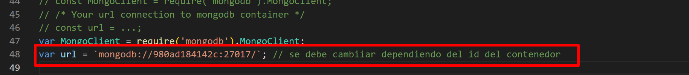
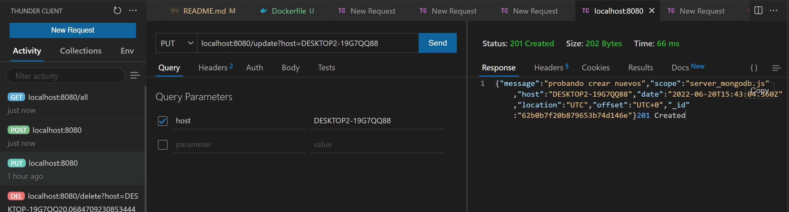

# Bootcamp API
## Instalación y descripción de un API basica en node.js utilizando mongoDB.

El siguiente documento muestra el proceso de instalación y uso de un API dockerizada, creada en node.js  y con la base de datos no relaciónal mongoDB.

## 1. Adecuación del ambiente Mongodb.

Se deben  descargar y instalar docker  como primer paso, una vez instalado docker se debera descargar una imagen de mongoDB, si se esta utilizando docker deskop, se podra hacer este paso graficamente:

Para realizar este proceso por consola:
    
    docker pull mongo

Una vez instalado la imagen de mongodb se creara un contenedor con dicha imagen con el siguiente comando: 

    docker run -d -p 27017:27017 --name example-mongo mongo:latest

donde el comando -p se encarga de configurar el puerto, usualemnte para mongo se utilizar el puerto 270107; el comando --name sera el nombre del contenedor a crear y por ultimo se seleccióna la imagen de donde saldra el contenedor  en el parametro mongo:latest y donde latest brinda información de la version.

Para facilitar la visualización de los datos se debe descargar [Mongodb Compass](https://www.mongodb.com/try/download/compass). Una vez instalado, se debe crear una nueva conexión y posteriomente conectar:

 

Una vez comprobada la cnexión del compass con mongodb se debera  ifentificar el id del contenedor donde se encuentra la imagen del mongodb con el siguiente comando:

    docker ps
    

Este id sera necesario para la conexión de nuestra api dockerizada con node.js.

## 2.1. Adecuación del ambiente dockerizción de API, creacíon de imagen.

Para dockerizar el api se tiene que primero clorar el repositorio  con:
    
    git clone <url>

Una vez descargado  procederemos a modificar la linea 48 del archivo server_mongodb.js  d ela siguiente manera:

    'mongodb://<id_container_mongo>:27017';

Un ejemplo de esto seria:

Una vez realizado este cambio se podra dockerizar la API con el siguiente comando en el cmd (Nota: Debe estar hubicado en el directorio del archivo):

    docker build  -t <myimage>:<version> .

En mi caso :

    docker build  -t api_bootcamp:0.1 .
    

Procederemos a comprobar que se haya creado la imagen ya sea graficamente:

O por medio del comando:

    docker images

## 2.2. Adecuación del ambiente dockerizción de API, crear network y iniciar api dockerizada.

Para la conexión entre dos containers se debe crear una red como puente, de la siguiente manera:

    docker network create <nombre de la red>

En mi caso: 
    
    docker network create mongo-network

Para verificar que la red  sea de puente se debe berificar que el nombre  en el driver sea bridge, esto se puede confirmar con el siguiente comando:

    docker network ls

Una vez creada la red, nuestro container de mongodb debe conextarse a  esta red:

    docker network connect <nombre de la red> <nombre del container>

Mis parametros:

    docker network connect mongo-network example-mongo

Por ultimo se desplegara el container a partir de la imagen de nuestra API y se tomara de una vez en cuenta el nombre de la red en la que debera conectarse:

    docker run -d -p 8080:8080 --network <nombre  de la red> --name <nombre container> <nombre de la imagen>:<version>

Mis parametros:

    docker run -d -p 8080:8080 --network mongo-network --name api api_bootcamp:0.1

Por ultimo revisamos los contenedor que se estan ejecutando con los mismos comandos que en el de mongodb.

## 3. Prueba API.
    Para estas pruebas se utilizo Thunder client extencion de visual studio code.
### Agregar información a la base de datos:
 
 1. Solicitud POST :
   Una solicitud post sin parametros a la dirección localhost:8080 creara la base de datos, la collecion y  nuestro primer grupo de datos:
    

2. Solucitud PUT : 
   
   Una solicitud put a la url localhost:8080/update con el parametro host si no encuentra un host con el mismo nombre procedera a crear uno nuevo con este nombre:

   

   Si se crea un nuevo dato respondera con 201 created.

   Si se encuentra uno o mas host con exactamente el parametro enviado, este modificara:

   

   Si se modificara respondera con 200 ok.

### Consultas :

1. Consulta get todos:

    Para consultar todos los datos que hay en la base de datos se enviara una solicitud http get a la url localhost:8080/all:

    

2. Consulta get por host:

    Para consultar un host se debe enviar un solicitd http get a la url localhost:8080/query con  el parametro host:

    

### Borrar datos filtrando el host:

    Para borrar se debe enviar una solicitud http delete a la url localhost:8080/delete con el parametro del host a eliminar:

    

    Si se elimina algun dato se enviara una respuesta 200 ok de lo ocntrario un 204 No content.
